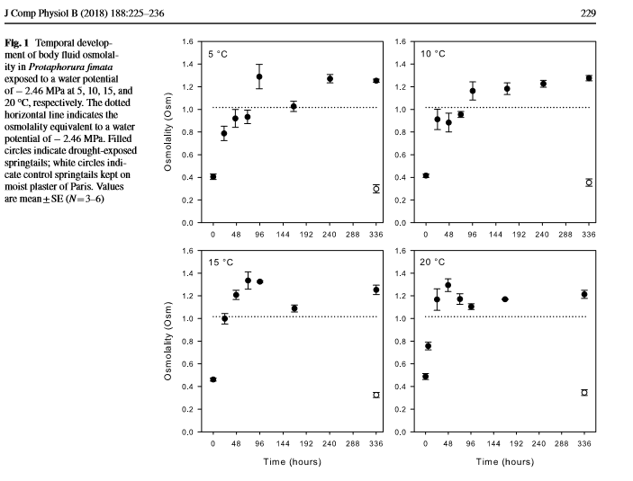

```{r setup, include=FALSE}
library(rmarkdown)
library(tidyverse)
library(magrittr)
library(knitr)
library(kableExtra)
library(readr)
library(stats)
library(Cairo)
library(ggpubr)
library(lme4)
library(chemCal)
library(latex2exp)
options(rgl.useNULL=TRUE)
library(rgl)
library(viridis)
library(readxl)
library(car)
library(extrafont)

knitr::opts_chunk$set(echo = T, message = FALSE, 
                      fig.height=10,fig.width=10, fig.align = "center", warning = FALSE)
knitr::knit_hooks$set(document = function(x) {sub('\\usepackage[]{color}', '\\usepackage{xcolor}', x, fixed = TRUE)},
                      webgl = hook_webgl)

trace(grDevices::png, quote({
  if (missing(type) && missing(antialias)) {
    type <- "cairo-png"
    antialias <- "subpixel"
  }
}), print = FALSE)
```


# Background 

Terrestrial arthropods’ ability to survive subzero winter temperatures is an important factor influencing their abundance and geographic distribution. It is, therefore, important to understand their physiological mechanisms of low-temperature survival. Acclimation to moderate–low temperature can improve cold tolerance, and pre-acclimation to mild desiccation can also improve survival of a subsequent cold exposure. 
In the present study, the authors combined cold acclimation with drought acclimation making it possible to assess the interactions between effects of these two stressors using the springtail Protaphorura fimata as a model organism. For more details and results in see [Holmstrup and Slotsbo (2018)](https://link.springer.com/article/10.1007%2Fs00360-017-1127-0).


</br>

# Purpose

In this exercise, you shall only model the effect of temperature and drought on osmolality, which is an important factor in the organisms ability to supercool and avoid damaging effects of freezing.

</br>

# Saturation model

In the analysis of the data you will be using an empirical saturation model,
$$y(t) = \frac{c_1 t}{c_2 + t}$$
where **t** is time, $c_1$ is the asymptotic value for **y** when $t \rightarrow \infty$, and $c_2$ is the half saturation point (the time when $y = c_1/2$).
In order to use the above saturation model in a GLM the model is inverse transformed, 
$$y(t)=\frac{c_1\ \ t}{c_2+\ t}\Leftrightarrow \frac{1}{y(t)} = \frac{c_2+\ t}{c_1 t}\Leftrightarrow \frac{1}{y(t)} = \frac{c_2}{c_1 t}+\frac{t}{c_1 t} \Leftrightarrow \frac{1}{y(t)} = \frac{c_2}{c_1}t^{-1}+c_1^{-1} $$


</br>

# Data 

In the Excel workbook “Data - springhaler” there are two datasets: 

1. Effect of drought and temp (Holmstrup and Slotsbo, 2018).
2. Osmolality with time (see Fig. 1 in Holmstrup and Slotsbo, 2018):

<p style="text-align:center;"></p>


</br>

## Read data from files

```{r}
OsmoTime <- read_xlsx("Data/Data opg2 - springhaler.xlsx", 
                      sheet = "Osmolality with time") %>% 
  mutate_at(c("Temperature"),factor)

DroughtTemp <- read_xlsx("Data/Data opg2 - springhaler.xlsx", 
                         sheet = "Effect of drought and temp") %>% 
  mutate_at(c("Temperature","Treatment"),factor)
```

</br>

# Tasks


</br>

## Use the dataset "Effect of drought and temp". Is there an effect of temperature or/and drought on osmolality?

To investigate whether *drought* and/or *temperature* has an effect on *osmolality*, we will first visually investigate:
```{r, fig.height=5}
ggplot(DroughtTemp, aes(x = Temperature, y = Osmolality, fill = Treatment)) +
  geom_boxplot() +
  scale_fill_brewer(palette = "Dark2") +
  scale_y_continuous(breaks = 1:8/5) +
  theme_bw() +
  theme(legend.position = c(0.95,0.5),
        legend.title = element_text(family = "Georgia",
                                  face = "bold",
                                  size = 14),
        legend.text = element_text(family = "Georgia",
                                  size = 12),
        legend.key.size = unit(c(10,10),"mm"),
        legend.background = element_blank(),
        axis.title = element_text(family = "Georgia",
                                  face = "bold",
                                  size = 14),
        strip.text = element_text(family = "Georgia",
                                  face = "bold",
                                  size = 14))
```
From where a substantial difference in *osmolarity* between the *control* group and *drought* treated group is obvious. On the other hand the effect of *temperature* on *osmolarity* is not very clear, but since we are only conducting a visual analysis we must be careful to reach conclusions yet.

For this reason we will move on to investigating the effectsizes and significance-levels quantitatively using a linear model: 

```{r}
droughtLM <- lm(Osmolality ~ Temperature + Treatment, data = DroughtTemp)

droughtCoef <- droughtLM %>% 
  summary %$%
  coefficients

droughtCoef %>% 
  round(5) %>%  
  kable(caption = "<center><b><h3> Result of the linear model using the formula: <br> Osmolality ~ Temperature + Treatment",
        escape = F,
        align = "c") %>% 
  kable_classic(full_width = F,
              font_size = 20, html_font = "Cambria") %>% 
  column_spec(1, bold = T) %>% 
  column_spec(5, background = if_else(droughtCoef[,4] < 0.05, "", "red", ""))
```

Which (unsurprisingly) confirms our suspicions from the visual analysis; the effect of *treatment* is large and statistically significant, while the effect of *temperature* is small and not statistically significant.
This concludes that the springtails' osmolality is effected by the drought but that the temperature does not have a significant effect on springtails' osmolality.


</br>

## Check the fit of the model used in task 1.

Next we check the fit of the model using R's inbuild diagnostic plots:
```{r, fig.height=5}
par(mfrow = c(1,2))
droughtLM %>% 
  plot(1:2)
```
From this analysis we can observe from  __Residuals vs Fitted plot__ that the residuals are randomly distribtuted on either side of the residual trend line. Furthermore the __Normal Q-Q plot__ shows that the dataset is approximatly normal distrubuted. 

</br>

## Use the above saturation model and the dataset "Osmolality with time". Fit the best line to each of the four temperature.


Again we first investigate visually, then move on to the quantitative model:
```{r}
labels <- lapply(c(5,10,15,20), FUN = function(x) paste0(x, "\u00B0C")) %>% 
  unlist %>% 
  setNames(OsmoTime$Temperature %>% levels)

OsmoTime %>% 
  arrange(Temperature %>% as.numeric) %>% 
  ggplot(aes(x = Hours^-1, y = Osmolality^-1, color = Temperature)) +
  geom_point() +
  geom_smooth(method = "lm", fullrange = T) +
  facet_wrap(~Temperature, labeller = as_labeller(labels)) +
  scale_color_brewer(palette = "Dark2") +
  labs(y = TeX("\\textbf{Osmolality^{-1}}"), x = TeX("\\textbf{Hours^{-1}}")) +
  theme_bw() +
  theme(legend.position = "none",
        axis.title = element_text(family = "Georgia",
                                  face = "bold",
                                  size = 14),
        strip.text = element_text(family = "Georgia",
                                  size = 14))
```

From which we observe a clear positive correlation between reciprocal *osmolality* and *hours*, and maybe a lower slope for higher temperatures. However we must again move on to the quantitative analyses before we reach conclusions.

```{r}
osmoLM <- OsmoTime %>% 
  mutate_at("Temperature", factor) %>% 
  mutate(Osmolality = Osmolality^-1,
         Hours = Hours^-1) %>% 
  lm(Osmolality ~ Hours*Temperature, data = .)

osmoLM$coefficients %>% 
  as.matrix() %>% 
  kable(digits = 3,
        caption = "<center><b><h3> Linear model output: <br> Osmolality ~ Hours*Temperature",
        format = "html",
        align = "c") %>% 
  kable_classic(full_width = F, lightable_options = "striped",
              font_size = 20, html_font = "Cambria") %>% 
  column_spec(1, bold = T) %>% 
  column_spec(2, width = "3cm")
```
Above we see the linear model

</br>

## Is there an effect of temperature on the asymptotic osmolality?


To answer the question of whether *temperature* has an effect on the asymptotic *osmolality*, we must first understand how to interpret the asymptotic *osmolality* from our model outputs. To understand this, we must first find an expression of the asymptotic *osmolality* from the original model:

$$\lim_{t \rightarrow \infty}{y(t)} =\lim_{t \rightarrow \infty}{\frac{c_1 t}{c_2 + t}} = c_1$$
And find it in our linearized model:

$$y(t)^{-1} = \frac{c_2}{c_1}t^{-1}+c_1^{-1}$$
Therefore we can interpret the **intercept** in our linear model as the reciprocal asymptotic *osmolality*. Therefore to test for an effect of *temperature* on asymptotic *osmolality*, we can test the effect of *temperature* on the **intercept**. This can be inferred from the significance-levels of model parameters:

```{r}
osmoCoef <- osmoLM %>% 
  summary %$% 
  coefficients

osmoCoef %>%
  round(4) %>% 
  kable(caption = "<center><b><h3> Linear model summary: <br> Osmolality ~ Hours*Temperature",
        escape = F,
        align = "c") %>% 
  kable_classic(full_width = F, lightable_options = "striped",
                 font_size = 20, html_font = "Cambria") %>% 
  column_spec(1, bold = T) %>% 
  column_spec(5, background =if_else(osmoCoef[,4] < 0.05, "", "red"))
```
Where we see only non-significant additive effects of *temperature*, which are exactly the effects on the **intercept**. This strongly implies that *temperature* has no effect on the asymptotic *osmolality*. 
We further investigate this by comparing the type II & III Anova *S*um of *S*quares:
```{r}
osmoAnova2 <- osmoLM %>% 
  Anova(type = "II")

osmoAnova2 %>% 
  kable(digits = 4,
        caption = "<center><b><h3> Anova - Type II <br> Osmolality ~ Hours*Temperature",
        align = "c") %>% 
  kable_classic(lightable_options = "striped",
              full_width = F,
              font_size = 20, html_font = "Cambria") %>% 
  column_spec(1, bold = T) %>% 
  column_spec(5, background = if_else(osmoAnova2$`Pr(>F)` < 0.05, "", "red", ""))

osmoAnova3 <-osmoLM %>% 
  Anova(type = "III")

osmoAnova3 %>% 
  kable(digits = 4,
        caption = "<center><b><h3> Anova - Type III <br> Osmolality ~ Hours*Temperature",
        align = "c") %>% 
  kable_classic(lightable_options = "striped",
                 full_width = F,
                 font_size = 20, html_font = "Cambria") %>% 
  column_spec(1, bold = T) %>% 
  column_spec(5, background = if_else(osmoAnova3$`Pr(>F)` < 0.05, "", "red", ""))
```
Where we see a drastic fall in Sum of Squares for *temperature* between type II & III, corresponding to inclusion of interaction terms in the model before calculating Sum of Squares in type-III. This is highly critical for the additive effect of *temperature*, and implies that instead *temperature* has an interactive effect with *hours*.
We thus find no significant effect of *temperature* on asymptotic *osmolality*, but we observe a significant additive effect between *temperature* and *hours*.


</br>

## What is the estimated asymptotic osmolality at 15 degrees? 

Since we have estimated no significant effect of *temperature* on asymptotic *osmolality*, the estimated asymptotic *osmolality* can be calculated independently of temperature as simply:

$$c_1 = \hat{intercept}^{-1}$$
And we then find the estimated asymptotic osmolality as <b> `r osmoCoef["(Intercept)","Estimate"]^-1 %>% round(3)` </b>.


</br>

## Is there an effect of temperature on the time to reach the half saturation point?


To investigative this we must, as when we investigated asymptotic *osmolality*, first investigate how to interpret the half saturation point from out model. Since we defined our first model:

$$y(t) = \frac{c_1 t}{c_2 + t}$$

In such as way that $c_2$ is exactly our half saturation point, it is quite easy to see from our linearized model:

$$y(t)^{-1} = \frac{c_2}{c_1}t^{-1}+c_1^{-1}$$
That we can find the half saturation point as $slope/intercept$. Since we found that there is no significant effect of *temperature* on intercept, but only an interactive effect (ie. effect on slope). We must conclude that *temperature* does have a significant effect on the half saturation point (i.e. time to reach half the asymptotic value). In our analysis we also see an effect of temperature on the time it takes to reach the halv saturation point, it is however only significant for temperatures of $15^\circ C$ and $20^\circ C$

</br>

## What is the estimated time to reach the half saturation point at 15 degrees?

We can now estimate our half saturation points from our model outputs:

```{r}
c_1I <- osmoCoef[1,"Estimate"]
c_1 <- c(c_1I^-1, ((osmoCoef[3:5,"Estimate"])+c_1I)^-1) %>% 
  unname

c_2H <- osmoCoef["Hours","Estimate"]
c_2 <- c(c_2H*c_1I^-1, (osmoCoef[6:8,"Estimate"] + c_2H)*c_1I^-1) %>% 
  unname

estimateKable <- tibble(Temperature = c(5,10,15,20), "asymptotic osmolality" = c_1, "half saturation time" = c_2) %>% round(4)

estimateKable %>% 
    kable(digits = 4,
        caption = "<center><b><h3> Estimates of asymtotic osmolality & half saturation time",
        align = "c",
        escape = F) %>% 
  kable_classic(lightable_options = "striped",
                 full_width = F,
                 font_size = 20, html_font = "Cambria") %>% 
  column_spec(1:3, background = if_else(1:4 == 3, "green", "", "")) 
```
And we thus find the estimated time to reach the half saturation point at 15 degrees as $\approx$ `r c_2[3] %>% round(3)` hours.


</br>

## Criticize the use of the above saturation model and check the fit of the model.

```{r,fig.height=5}
par(mfrow = c(1,2))
osmoLM %>% 
  plot(1:2)

```
We see from the __Normal Q-Q plot__ that the dataset is approximately normal distributed. 

The residual plot shows a random pattern which indicates a linear model with a good fit. But the plot also have some flaws. We see a higher fit on the lower values compared to the higher values this is most likely caused by a having more datapoints at lower values of _osmolality_ an thus a better fit on lower values. This is because it is not as relavant to look at data points after the asymptope is reached.


</br>

## Compare and discuss the results of tasks 1 and 4.
If we look at the results from task 1 the results shows that treatment alone has a significant effect on the osmolality of springtails and that temperature has no significant effect. The reason for this is because there is a maximum osmolality of springtails and even with higher temperatures this will not be changed. This does not mean that temperature has no effect at all. This is becaused the model in task 1 only accounts for temperature effect on osmolality alone and not compared to time. In task 4 we see same results when we look at temperatures effect on springtails osmolality which is no significant effect. But in task 4 we also look at temperatures effect on springtails osmolality as a funktion on hours. By doing this we see a significant effect of temperature how fast a higher osmolality is reached. This is most likely because of the change of osmolality is caused by metabolic activity of springtails, and these metabolic activities are more effective at higher temperatures.


</br>

## Visualization of the models

The figures below are subject to change and only here for exploration and testing purposes.

```{r,echo=F}
plots <- list()
temperature <- c(5,10,15,20)

for (i in 1:4) {
  if (i == 1) {
    xLab = ""
    yLab = "Osmolality"
    xText = element_blank()
    xTicks = element_blank()
    yText = element_text()
    yTicks = element_line()
  }
  else if (i == 2) {
    xLab = ""
    yLab = ""
    xText = element_blank()
    xTicks = element_blank()
    yText = element_blank()
    yTicks = element_blank()
  }
  else if (i == 3) {
    xLab = "Hours"
    yLab = "Osmolality"
    xText = element_text()
    xTicks = element_line()
    yText = element_text()
    yTicks = element_line()
  }
  else {
    xLab = "Hours"
    yLab = ""
    xText = element_text()
    xTicks = element_line()
    yText = element_blank()
    yTicks = element_blank()
  }
  plots[[i]] <- OsmoTime %>% 
    filter(Temperature == temperature[i]) %>% 
    ggplot(aes(x = Hours, y = Osmolality)) +
    geom_point() +
    stat_function(fun=function(x,a,b) {(a * x) / (b + x)},
                  args=list(a=c_1[i],b=c_2[i]),
                  color = "blue", xlim = c(0,400)) +
    geom_hline(yintercept = c_1[i], color = "red") +
    annotate("text", x = 250, y = round(c_1[i],3)+0.03, 
             label = paste("Asymptote =", round(c_1[i],3)),
             color = "red", family = "Georgia") +
    annotate("label", x = 350, y = 1.55, 
             label = paste("T =", temperature[i]), face = "bold",
             family = "Arial",
             size = 8, align = "outward") +
    coord_cartesian(ylim = c(0.6,1.6), xlim = c(0,400),
                    expand = F) +
    labs(x = xLab, y = yLab) +
    theme_bw() +
    theme(plot.title = element_text(hjust = 0.5,
                                    family = "Georgia"),
          axis.text.x = xText,
          axis.text.y = yText,
          axis.text = element_text(family = "Georgia"),
          axis.ticks.x = xTicks,
          axis.ticks.y = yTicks,
          plot.margin = margin(5,5,0,0,"mm"))
}

ggarrange(plotlist = plots)
```

```{r}
OsmoTime %>% 
  group_by(interval = cut_interval(Hours,10)) %>% 
  summarize(mean = mean(Osmolality),
            sd = sd(Osmolality)/n()) %>% 
  ggplot(aes(x = interval, y = mean, 
             ymin = mean - sd, ymax = mean + sd)) +
  geom_point() +
  geom_errorbar(width=0.2)

OsmoTime %>% 
  group_by(interval = cut_interval(Hours,5), Temperature) %>% 
  summarize(mean = mean(Osmolality),
            sd = sd(Osmolality)/n()) %>% 
  mutate(intervalList = interval %>% as.character() %>% 
           str_remove_all("\\[|\\(|\\)|\\]") %>% 
           str_split(",")) %>% 
  unnest_wider(intervalList) %>% 
  mutate(...1 = as.numeric(...1),
         ...2 = as.numeric(...2)) %>% 
  ggplot(aes(ymin = mean - sd, ymax = mean + sd, 
             xmin = ...1, xmax = ...2)) +
  geom_rect() +
  facet_wrap(~Temperature)

OsmoTime %>% 
  ggplot(aes(x = Hours^-1, y = Osmolality^-1, 
             color = Temperature, fill = Temperature,
             group = Temperature)) +
  stat_summary_bin(fun.data = "mean_se",
                   geom = "ribbon", alpha = 0.25) +
  stat_summary_bin(fun.data = "mean_se") +
  geom_point() + 
  geom_smooth(method = "lm", fullrange = T,
              color = "black", fill = "black",
              alpha = 0.15, size = 0.25) +
  facet_wrap(~Temperature, scale = "free") +
  scale_color_brewer(palette = "Dark2") +
  scale_fill_brewer(palette = "Dark2")
```

## What if temperature was a continous variable?
By considering temperature as a continous variable instead of as a categorical variable, we can explore the effect of temperature on the progression of osmolality outside the studied temperature-space:
```{r}
tempCont <- read_xlsx("Data/Data opg2 - springhaler.xlsx", 
                      sheet = "Osmolality with time")
tempContLM <- tempCont %>% 
  mutate(Osmolality = Osmolality^-1,
         Hours = Hours^-1) %>% 
  lm(Osmolality ~ Hours:Temperature + Hours, data = .)

tempContLM
```

We now get a formula for osmolality as follows:

$$y^{-1} = (\alpha_h+\alpha_T\cdot T)\cdot h^{-1}+\beta$$
Where $y$ is *osmolality*, $h$ is hours, $T$ is *temperature*, $\alpha_h$ is the coefficient of *hours* ("slope"), while $\alpha_T$ is the interaction coefficient of *temperature* on *hours* and $\beta$ is the intercept. We can then isolate *temperature* ($T$):

$$h(y^{-1}-\beta)=\alpha_h + \alpha_T \cdot T$$
$$T=\frac{\frac{h}{y}-\beta\cdot h-\alpha_h}{\alpha_T}=\alpha_T^{-1}\frac{h}{y}-\alpha_T^{-1}\beta\cdot h-\alpha_T^{-1}\alpha_h$$
Then *temperature* can be modelled as a function of *hours* and *osmolality* as follows:

$$T(h,y)=\frac{1}{-0.6089}\frac{h}{y}-\frac{0.7937}{-0.6089}\cdot h - \frac{14.9685}{-0.6089}$$
$$=-1.6829 \frac{h}{y}+1.350555\cdot h+24.76271$$
This function can be visually represented in 2d-space by having *hours* and *osmolality* on the axis and coloring by *temperature*. 

```{r,webgl=T}
test <- tibble(Hours = rep(list(seq(0,400,0.5)),2000), Osmolality = seq(0.001,2,0.001)) %>% 
  unnest(Hours) %>% 
  mutate(Temperature = -1.6829 * Hours/Osmolality + 1.350555 * Hours + 24.76271) 

test %>%   
  filter(between(Temperature,5,20)) %>% 
  ggplot(aes(x = Hours, y = Osmolality, fill = Temperature)) +
  geom_raster() +
  geom_point(data=OsmoTime, aes(x=Hours,y=Osmolality, color = Temperature), fill = "black") +
  scale_fill_viridis_c(option = "inferno") +
  scale_color_viridis_d(option = "inferno") +
  coord_cartesian(ylim=c(0,1.5), xlim=c(0,400), expand=F) +
  theme_minimal() +
  ggsave("temperatureContinousOld.png",type="cairo-png")
```


